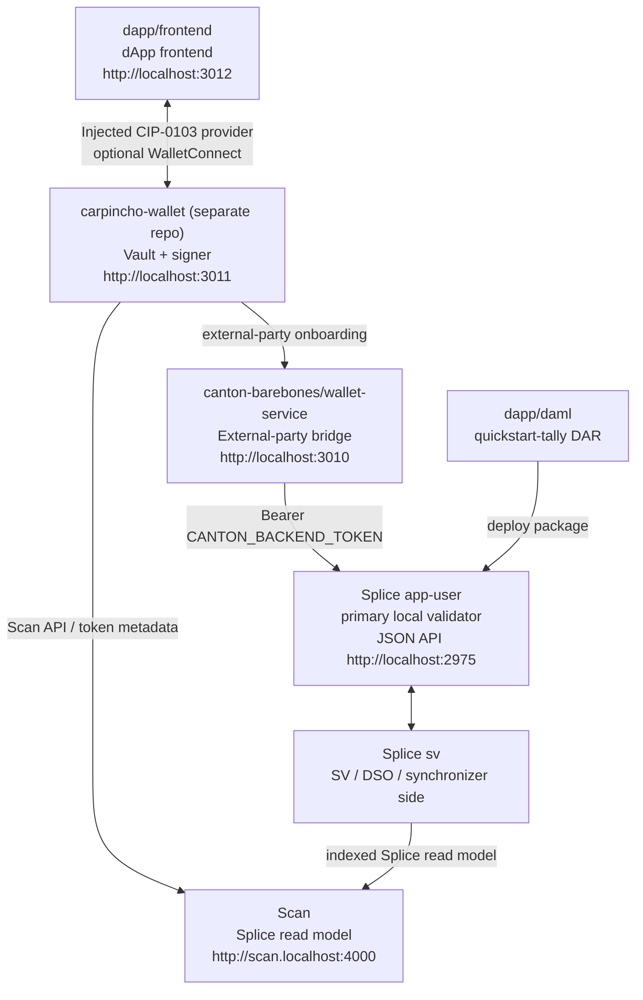

# Canton dApp Booster

Local Canton Network stack for wallet-first dApp experiments.



`canton:up` activates the official Splice LocalNet `sv` and `app-user` Docker
profiles, then starts wallet-service. It does not start Keycloak or OIDC.
The app-provider UI containers are not started; a local compose override
disables their Nginx routes. The official shared Canton/Splice containers still
expose app-provider backend ports because the bundle bakes that config in.
Splice and wallet-service share the `canton-barebones` Docker Compose project,
so Docker groups the full local stack together.
`app-user` is Splice's technical name for the primary local validator; it is not
the Carpincho user.

## Installation

Prerequisites:

- Node.js 24.15.0 or newer (the exact version is pinned in `.nvmrc`)
- pnpm (via Corepack: `corepack enable`; the repo pins pnpm 11 through `packageManager`)
- Docker with about 8 GB memory available
- `dpm` on `PATH` (DAML SDK 3.4.11), required for building DARs

Install workspace dependencies:

```bash
pnpm install
```

Create the local env file:

```bash
cp canton-barebones/.env.example canton-barebones/.env
```

Generate the backend token and paste the printed `CANTON_BACKEND_TOKEN=...`
line into `canton-barebones/.env`:

```bash
pnpm run canton:token -- ledger-api-user
```

Token configuration:

| Name | What It Is | Who Uses It |
| --- | --- | --- |
| `CANTON_AUTH_AUDIENCE` | JWT audience recipe value | token script |
| `CANTON_AUTH_SECRET` | local unsafe JWT signing secret | token script only |
| `CANTON_BACKEND_TOKEN` | generated JWT pasted into `.env` | wallet-service |
| Carpincho LocalNet token | generated JWT pasted into Carpincho settings | Carpincho |

The token script uses `ledger-api-user` as the default JWT subject. Generate
another token with the same script or reuse the backend token locally. Do not
copy `CANTON_AUTH_SECRET` into Carpincho.

## Quick Start

Start the stack:

```bash
pnpm run canton:up
pnpm run canton:health
```

Build and deploy the sample DAR:

```bash
pnpm run build-dar -- dapp/daml
pnpm run deploy-dar -- dapp/daml/.daml/dist/quickstart-tally-0.0.1.dar
```

Verify wallet-service:

```bash
pnpm run wallet-service:health
```

Start the dApp:

```bash
pnpm run app:dev
```

Run the Carpincho wallet from its own repo
([github.com/BootNodeDev/carpincho-wallet](https://github.com/BootNodeDev/carpincho-wallet));
it serves on `http://localhost:3011`.

Open the dApp:

```text
http://localhost:3012
```

The vesting dApp runs **mock-first** (a DirectWallet party-picker + in-memory
backend), so it needs neither the stack above nor Carpincho — pick any party on the
landing screen to act as it. The live wallet-service / Carpincho path is deferred.

## Extension

The Carpincho browser extension is built and released from its own repository:
[github.com/BootNodeDev/carpincho-wallet](https://github.com/BootNodeDev/carpincho-wallet).
See that repo's README for build and load instructions.

## Services And Ports

| Service | What It Is | URL / Port | Who Uses It |
| --- | --- | --- | --- |
| wallet-service | Carpincho bridge for external-party onboarding | `http://localhost:3010` | Carpincho |
| Carpincho wallet | Browser wallet UI/provider | `http://localhost:3011` | user/dApp |
| dApp frontend | Example dApp | `http://localhost:3012` | user |
| app-user Wallet UI | Official Splice wallet UI for app-user | `http://wallet.localhost:2000` | optional/manual |
| app-user Ledger API | gRPC Ledger API | `grpc://localhost:2901` | SDK/tools |
| app-user Admin API | gRPC Admin API | `grpc://localhost:2902` | wallet-service/tools |
| app-user Validator API | Splice validator readiness/API | `http://localhost:2903` | health/tools |
| app-user JSON API | JSON Ledger API | `http://localhost:2975` | wallet-service/tools |
| app-user Validator proxy | wallet-sdk validator route | `http://localhost:2000/api/validator` | Carpincho |
| app-provider backend APIs | Official bundle backend wiring, unused here | `grpc://localhost:3901`, `grpc://localhost:3902`, `http://localhost:3903`, `http://localhost:3975` | not used |
| app-provider UI port | Nginx port exposed by the bundle; routes disabled here | `http://localhost:3000` | not used |
| Scan UI | Splice explorer/read model UI | `http://scan.localhost:4000` | optional/manual |
| Scan API | Splice indexed API | `http://scan.localhost:4000/api/scan` | Carpincho/tools |
| Amulet Registry | token metadata via scan proxy | `http://localhost:2000/api/validator/v0/scan-proxy` | Carpincho/tools |
| SV UI | Super Validator operations UI | `http://sv.localhost:4000` | optional/manual |
| sv Ledger/Admin/JSON APIs | Official SV participant APIs | `grpc://localhost:4901`, `grpc://localhost:4902`, `http://localhost:4975` | Splice internals/tools |
| sv Validator API | SV readiness/admin surface | `http://localhost:4903` | health checks |
| PostgreSQL | Splice LocalNet DB | `localhost:5432` | LocalNet containers/tools |

If `wallet.localhost`, `scan.localhost`, or `sv.localhost` do not resolve, add:

```text
127.0.0.1 wallet.localhost scan.localhost sv.localhost
```

## Development

Root scripts, run from the repo root:

| Command | What it does |
| --- | --- |
| `pnpm lint` | Biome check across the JS workspaces (fails on warnings) |
| `pnpm typecheck` | `tsc --noEmit` in every TS workspace |
| `pnpm build` | Build every workspace (`dapp/daml` needs `dpm`) |
| `pnpm test` | Run each workspace's test suite |
| `pnpm knip` | Dead-code and unused-dependency scan |

### Secret scanning

The husky hooks scan for secrets with gitleaks: `pre-commit` on staged changes and
`pre-push` on the outgoing commit range. On first run they install the pinned gitleaks into
`bin/` (git-ignored) via [`scripts/install-gitleaks.sh`](scripts/install-gitleaks.sh) —
checksum-verified, version read from [`.gitleaks-version`](.gitleaks-version), the same
install CI uses. Accepted non-secret findings (test fixtures, legacy history) are listed in
[`.gitleaksignore`](.gitleaksignore); a new secret still fails the scan.

### Continuous integration

Every pull request runs the [`pr`](.github/workflows/pr.yml) gate: biome, typecheck + build
+ knip, tests, commitlint (commit range + PR title), and a full-history gitleaks scan. `main`
is protected — a PR needs one approval and all checks green to merge. New issues and PRs are
added to the project board ([`add-to-project`](.github/workflows/add-to-project.yml)) and PRs
are assigned to their author ([`pr-assign`](.github/workflows/pr-assign.yml)).

### Dependency updates

[Renovate](renovate.json) batches non-major updates into one weekly PR. The `@canton-network/*`
SDK graph is pinned in `pnpm-workspace.yaml` and held for manual approval on the Dependency
Dashboard, so it is never bumped without a deliberate review.
