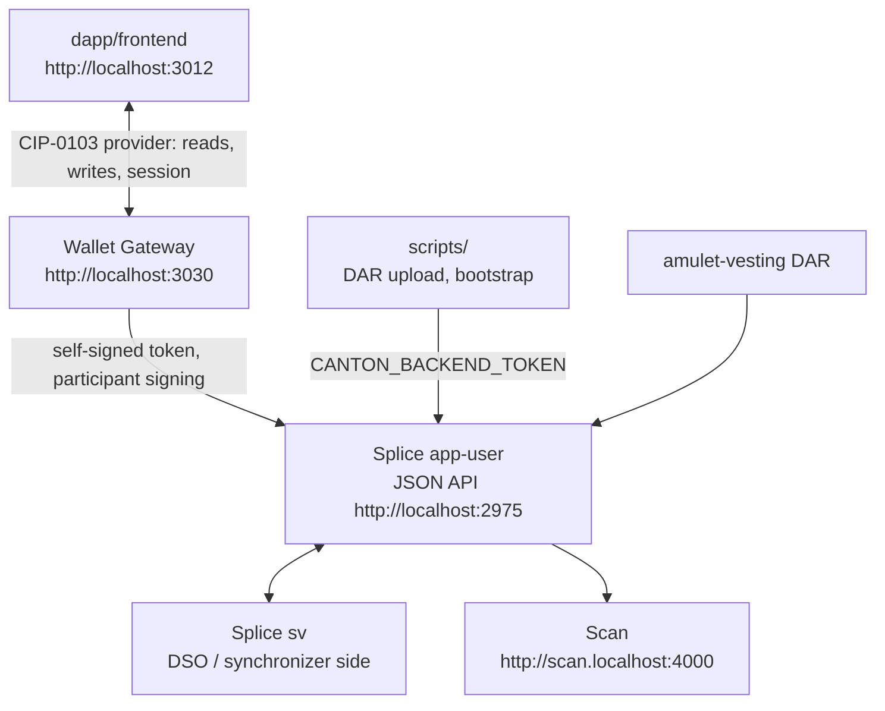

# Architecture Overview — Canton dAppBooster

## Tech Stack

| Subproject | Stack | Purpose |
| --- | --- | --- |
| LocalNet (external: [BootNodeDev/canton-barebones](https://github.com/BootNodeDev/canton-barebones)) | Node CLI over Docker Compose + the official Splice LocalNet bundle | Starts `sv + app-user`. A pinned devDependency, scaffolded by `dev-stack.sh` into the gitignored `.canton-localnet/` |
| Wallet Gateway (external: [canton-network/wallet](https://github.com/canton-network/wallet)) | Node + Express + SQLite | The CIP-0103 wallet the dApp connects to: it holds the session, signs through the participant, and serves its own user UI. A root devDependency, run on the host by `scripts/dev-stack.sh` from `wallet-gateway.config.json` |
| `scripts/` | Bash + Node | The local loop: `dev-stack.sh`, the Splice dep fetch, the DAR build and upload, the token mint, the vesting bootstrap |
| `kit/` | Node + JSON | The tooling that reads the three libraries' source: the doc, anatomy and version gates, the release bump, and the typedoc configs. Grouped so a consumer scaffold deletes it whole; see [`CLAUDE.md`](CLAUDE.md) |
| `dapp/frontend/` | Vite + React + Ark UI + Tailwind v4 + zustand + react-router | Canton Coin **vesting** dApp; every read and write goes through the connected CIP-0103 wallet via `canton-connect` |
| `dapp/daml/` | DAML | `amulet-vesting` DAR: the vesting factory, proposal, contract and residual-claim templates, escrowing real Canton Coin as a Splice `LockedAmulet`. Vendored from [BootNodeDev/cc-vesting-contracts](https://github.com/BootNodeDev/cc-vesting-contracts); its Splice data-dependencies are fetched, not committed |
| `canton-connect/` | TypeScript + React 19 | wagmi-style hooks wrapping the dapp-sdk facade |
| `canton-dappbooster/` | TypeScript + React 19 + tsdown | L2 headless UI components, zero styling, plus the theme runtime and the pure utilities under the components, exact-decimal amounts included |
| `canton-theme/` | CSS | L3 plain-CSS theme: `--cnc-*` tokens + prestyled defaults |

Each subproject's `architecture.md` is the index of its own seams. A subsystem that needs more than
a seam gets a chapter in a sibling `architecture/` folder, linked from that index; `canton-connect/`
carries two today.

## Data Flow

> `dapp/frontend` hosts the Canton Coin vesting dApp. Every ledger read and every submission goes
> through the wallet over CIP-0103, so the dApp only ever acts as the connected account and each
> write is signed by the account's own key. One call is not a ledger path: an Amulet-moving choice
> takes the current `AmuletRules` and open mining round as an argument, and no connected party is a
> stakeholder of either. `transferContext.ts` still asks a JSON-RPC host at `VITE_WALLET_RPC_URL`
> for them, and nothing answers there now that wallet-service is gone, so every write and the
> faucet fail until that source is replaced. Reads are unaffected.

`app-user` is the primary local validator from the official Splice LocalNet
bundle. It is not a product user. `sv` provides the Super Validator / DSO side
needed by Splice and Canton Coin. The app-provider UI profile is not started;
its Nginx routes are disabled locally. The official shared Canton/Splice
containers still expose app-provider backend ports.

State boundaries:

- The CIP-0103 path: a dApp talks to the wallet through the provider surface, which is how the vesting dApp in `dapp/frontend` gets its session, its ledger reads, and its submissions.
- The wallet owns user keys and signs locally.
- `CANTON_BACKEND_TOKEN` belongs to the scripts alone: the DAR upload and the vesting bootstrap.
  Nothing in the browser ever holds it.
- Splice LocalNet owns the app-user participant/validator, Scan, SV, and CC infrastructure.
- The wallet should use generated bearer tokens for direct LocalNet endpoints; it should not copy `CANTON_AUTH_SECRET` into the browser.

## Services And Ports

| Service | URL / Port | Purpose |
| --- | --- | --- |
| dApp frontend | `http://localhost:3012` | example dApp |
| Wallet Gateway | `http://localhost:3030` | the wallet: user UI, and `/api/v0/dapp` for the dApp |
| app-user Wallet UI | `http://wallet.localhost:2000` | optional official Splice wallet UI |
| app-user Ledger API | `grpc://localhost:2901` | SDK/tools |
| app-user Admin API | `grpc://localhost:2902` | SDK/tools |
| app-user Validator API | `http://localhost:2903` | health/tools |
| app-user JSON API | `http://localhost:2975` | scripts/tools |
| app-user Validator proxy | `http://localhost:2000/api/validator` | wallet/tools |
| app-provider backend APIs | `grpc://localhost:3901`, `grpc://localhost:3902`, `http://localhost:3903`, `http://localhost:3975` | official bundle wiring, unused |
| app-provider UI port | `http://localhost:3000` | exposed by Nginx, routes disabled |
| Scan UI | `http://scan.localhost:4000` | explorer/read model UI |
| Scan API | `http://scan.localhost:4000/api/scan` | wallet/tools |
| Amulet Registry | `http://localhost:2000/api/validator/v0/scan-proxy` | token metadata |
| SV UI | `http://sv.localhost:4000` | Super Validator operations UI |
| sv Ledger/Admin/JSON APIs | `grpc://localhost:4901`, `grpc://localhost:4902`, `http://localhost:4975` | Splice internals/tools |
| sv Validator API | `http://localhost:4903` | health checks |
| PostgreSQL | `localhost:5432` | Splice LocalNet database |

## Auth

| Variable | Owner | Purpose |
| --- | --- | --- |
| `CANTON_AUTH_AUDIENCE` | `.env` | JWT audience recipe used by `scripts/mint-token.mjs` |
| `CANTON_AUTH_SECRET` | `.env` | unsafe local signing secret used only by the token script |
| `CANTON_BACKEND_TOKEN` | `.env` | generated JWT consumed by the DAR upload and the vesting bootstrap |

The root `.env` is the only one that matters: the signing recipe `scripts/mint-token.mjs`
reads, plus the token `scripts/deploy-dar.sh` and `scripts/bootstrap-vesting.mjs` send. Minting
is offline, so it needs nothing running, which is what lets `dev-stack.sh up` mint
`CANTON_BACKEND_TOKEN` into a fresh `.env`
before anything is up. The LocalNet is configured by its own `canton-barebones.config.json`,
scaffolded into `.canton-localnet/` and tracked by nothing.

`CANTON_AUTH_AUDIENCE` plus `CANTON_AUTH_SECRET` is the local signing recipe.
`CANTON_BACKEND_TOKEN` is the generated token. The token script defaults the
JWT subject to `ledger-api-user`.

The Wallet Gateway mints its own token from the same recipe rather than reading `.env`:
`wallet-gateway.config.json` carries the LocalNet audience, `ledger-api-user` as the client id,
and `unsafe` as the signing secret, which is the secret Splice LocalNet runs on. Its login page
asks for that secret and nothing else.

## Orchestration

| Command | What it does |
| --- | --- |
| `./scripts/dev-stack.sh up` | the whole local loop: LocalNet, DAR, bootstrap, Wallet Gateway, dApp dev server |
| `./scripts/dev-stack.sh down` | stop the gateway and the dApp dev server, stop the LocalNet |
| `pnpm run wallet-gateway` | the gateway alone, from `wallet-gateway.config.json` |
| `pnpm exec canton-barebones start` / `stop` / `reset` / `status` | the LocalNet itself, run from `.canton-localnet/` |
| `node scripts/localnet-config.mjs <dir>` | scaffold that directory and apply the flags nginx needs |
| `pnpm run mint-token` | generate a LocalNet dev JWT, offline |
| `pnpm run build-dar` | fetch the Splice deps, then compile the DAR with `dpm` |
| `pnpm run deploy-dar -- <dar>` | upload DAR to app-user JSON API |
| `pnpm run bootstrap` | create the vesting operator and its factory |
| `pnpm run app:dev` | start the dApp frontend |

`dev-stack.sh` shells out to the LocalNet tool in the directory passed as its second argument
(`./scripts/dev-stack.sh up <dir>`), else `CANTON_LOCALNET_DIR`, else `.canton-localnet/`. It
scaffolds that directory on `up` from the pinned tool's own template, re-scaffolding when the
template moves past the local copy, so the config drifts from the installed version rather than
from a committed file. The Splice checkout and the runtime env land in its `.generated/`.

For the bring-up sequence, follow [`README.md`](README.md).

## Packaging

`canton-connect`, `canton-dappbooster` and `canton-theme` are three npm packages that also happen to
sit in this repo. Which copy a consumer gets is decided per install, by version:

| Where | What resolves | Why |
| --- | --- | --- |
| this repo | the local folder, symlinked into `node_modules` | `linkWorkspacePackages: true` in `pnpm-workspace.yaml`, and the folder's `version` satisfies the declared range |
| a project scaffolded from it | the published package, downloaded from npm | the folder is not there, so pnpm falls back to the registry |

Both cases read the same `package.json`. Nothing in `dapp/frontend` or `canton-dappbooster` names a
workspace, only a range (`^0.3.1`), which is why the same file works in a repo that has the folders
and in one that does not.

What the two cases resolve *to* differs as well. Each TypeScript library's `exports` carries a
`development` condition pointing at `src`, so the dApp's Vite and `tsc` compile library source
directly. The published copy has no such condition — `publishConfig.exports` overrides the map at
publish time — so a consumer resolves `dist`, built by `prepack`.

`pnpm run release` publishes the three in dependency order, and
[`.github/workflows/release.yml`](.github/workflows/release.yml) is what runs it, on a published
GitHub release. The bump before that is one command,
[`kit/release-version.mjs`](kit/release-version.mjs): it moves four versions in lockstep —
the root and the three libraries — rewrites every range that points at one of them, commits, tags,
pushes, and leaves a draft release for a human to publish.

The version ranges are the link, so a bump that outruns them turns a local folder into a download
without saying so. [`kit/check-versions.mjs`](kit/check-versions.mjs) is what catches that,
in `pnpm test` and in the PR job, and it doubles as the release workflow's check that the tag and
the manifests agree. The packaging rules in [`CLAUDE.md`](CLAUDE.md) cover the rest.
