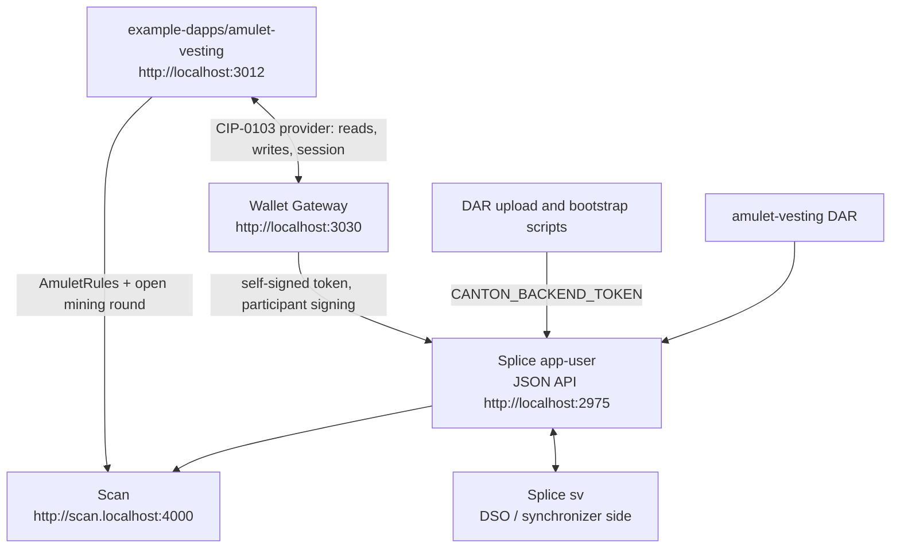

# Architecture overview for Canton dAppBooster

## Tech stack

| Subproject | Stack | Purpose |
| --- | --- | --- |
| LocalNet (external: [`BootNodeDev/canton-barebones`](https://github.com/BootNodeDev/canton-barebones)) | Node command-line tool over Docker Compose + the official Splice LocalNet bundle | Starts `sv + app-user`. A pinned dev dependency; `pnpm stack` scaffolds its config into the gitignored `.canton-localnet/` |
| Wallet Gateway (external: [`canton-network/wallet`](https://github.com/canton-network/wallet)) | Node + Express + SQLite | The CIP-0103 wallet the dApp connects to: it holds the session, signs through the participant, and serves its own user UI. A root dev dependency, which `pnpm stack` runs on the host from `canton-create/scaffold/localnet/wallet-gateway.config.json` |
| `kit/` | Node + JSON | The tooling that reads the three libraries' source: the doc, anatomy and version gates, the release bump, and the `typedoc` configs. See [`CLAUDE.md`](CLAUDE.md) |
| `example-dapps/amulet-vesting/` | Vite + React + Ark UI + Tailwind v4 + `zustand` + react-router + Daml | Canton Coin **vesting** dApp, published as an example. Every read and write goes through the connected CIP-0103 wallet via `canton-connect`. Its `daml/` holds the `amulet-vesting` DAR: the vesting factory, proposal, contract and residual-claim templates. They hold real Canton Coin in escrow as a Splice `LockedAmulet`, and come vendored from [`BootNodeDev/cc-vesting-contracts`](https://github.com/BootNodeDev/cc-vesting-contracts). The build fetches its Splice data-dependencies rather than committing them. `scripts/bootstrap-vesting.mjs` creates the operator and its factory |
| `canton-create/` | TypeScript + Ink + React 19 + `tsdown` | The `create-canton-dappbooster` installer. Its `scaffold/daml-tooling/` and `scaffold/localnet/` scripts are also the local loop: the Splice dependency fetch, the DAR build and upload, the token mint and `dev-stack.sh`. See [`canton-create/architecture.md`](canton-create/architecture.md) |
| `canton-connect/` | TypeScript + React 19 | wagmi-style hooks wrapping the `dapp-sdk` facade |
| `canton-dappbooster/` | TypeScript + React 19 + `tsdown` | L2 headless UI components, zero styling, plus the theme runtime and the pure utilities under the components, exact-decimal amounts included |
| `canton-theme/` | CSS | L3 plain-CSS theme: `--cnc-*` tokens + styled defaults |

Each subproject's `architecture.md` is the index of its own seams. A subsystem that needs more than
a seam gets a page in a sibling `architecture/` folder, linked from that index; `canton-connect/`
carries two today.

## Data flow

```mermaid
flowchart TD
  fe["example-dapps/amulet-vesting<br/>http://localhost:3012"]
  gw["Wallet Gateway<br/>http://localhost:3030"]
  au["Splice app-user<br/>JSON API http://localhost:2975"]
  sv["Splice sv<br/>DSO / synchronizer side"]
  scan["Scan<br/>http://scan.localhost:4000"]
  dar["amulet-vesting DAR"]
  scripts["DAR upload and bootstrap scripts"]

  fe -->|"AmuletRules + open mining round"| scan
  fe <-->|"CIP-0103 provider: reads, writes, session"| gw
  gw -->|"self-signed token, participant signing"| au
  scripts -->|"CANTON_BACKEND_TOKEN"| au
  au <--> sv
  au --> scan
  dar --> au
```

> `example-dapps/amulet-vesting` hosts the Canton Coin vesting dApp. Every ledger read and every
> submission goes through the wallet over CIP-0103. The dApp only ever acts as the connected
> account, and the account's own key signs each write. One call is not a ledger path. An
> Amulet-moving choice takes the current `AmuletRules` and open mining round as an argument, and no
> connected party is a stakeholder of either. `transferContext.ts` reads both from Scan, at
> `VITE_SCAN_API_URL`, and the browser makes those calls itself.

`app-user` is the primary local validator from the official Splice LocalNet
bundle. It is not a product user. `sv` provides the Super Validator / DSO side
needed by Splice and Canton Coin. The local stack does not start the app-provider
UI profile and turns off its nginx routes. The official shared Canton/Splice
containers still expose app-provider backend ports.

State boundaries:

- The CIP-0103 path: a dApp talks to the wallet through the provider interface. That is how the vesting dApp in `example-dapps/amulet-vesting` gets its session, its ledger reads, and its submissions.
- The wallet owns user keys and signs locally.
- `CANTON_BACKEND_TOKEN` belongs to the scripts alone: the DAR upload and the vesting bootstrap.
  Nothing in the browser ever holds it.
- Splice LocalNet owns the app-user participant/validator, Scan, SV, and CC infrastructure.
- The wallet should use generated bearer tokens for direct LocalNet endpoints; it should not copy `CANTON_AUTH_SECRET` into the browser.

## Services and ports

| Service | URL / Port | Purpose |
| --- | --- | --- |
| dApp frontend | `http://localhost:3012` | example dApp |
| Wallet Gateway | `http://localhost:3030` | the wallet: user UI, and `/api/v0/dapp` for the dApp |
| app-user Wallet UI | `http://wallet.localhost:2000` | optional official Splice wallet UI |
| app-user Ledger API | `grpc://localhost:2901` | SDK/tools |
| app-user administration API | `grpc://localhost:2902` | SDK/tools |
| app-user Validator API | `http://localhost:2903` | health/tools |
| app-user JSON API | `http://localhost:2975` | scripts/tools |
| app-user Validator proxy | `http://localhost:2000/api/validator` | wallet/tools |
| app-provider backend APIs | `grpc://localhost:3901`, `grpc://localhost:3902`, `http://localhost:3903`, `http://localhost:3975` | official bundle wiring, unused |
| app-provider UI port | `http://localhost:3000` | exposed by nginx, routes turned off |
| Scan UI | `http://scan.localhost:4000` | explorer/read model UI |
| Scan API | `http://scan.localhost:4000/api/scan` | wallet/tools |
| Amulet Registry | `http://localhost:2000/api/validator/v0/scan-proxy` | token metadata |
| SV UI | `http://sv.localhost:4000` | Super Validator operations UI |
| `sv` ledger, administration and JSON APIs | `grpc://localhost:4901`, `grpc://localhost:4902`, `http://localhost:4975` | Splice internals/tools |
| `sv` Validator API | `http://localhost:4903` | health checks |
| PostgreSQL | `localhost:5432` | Splice LocalNet database |

## Auth

| Variable | Owner | Purpose |
| --- | --- | --- |
| `CANTON_AUTH_AUDIENCE` | `.env` | JWT audience recipe used by `mint-token.mjs` |
| `CANTON_AUTH_SECRET` | `.env` | unsafe local signing secret used only by the token script |
| `CANTON_BACKEND_TOKEN` | `.env` | generated JWT consumed by the DAR upload and the vesting bootstrap |

`example-dapps/amulet-vesting/.env` is the only one that matters: the signing recipe
`mint-token.mjs` reads, plus the token `deploy-dar.sh` and the example's
`scripts/bootstrap-vesting.mjs` send. The root scripts point the first two at it through
`CANTON_APP_DIR`. Minting is offline, so it needs nothing running, which is what lets
`pnpm stack up` mint `CANTON_BACKEND_TOKEN` into a fresh `.env` before anything is up. The
LocalNet reads its own `canton-barebones.config.json`, which `dev-stack.sh` scaffolds into
`.canton-localnet/` and git does not track.

`CANTON_AUTH_AUDIENCE` plus `CANTON_AUTH_SECRET` is the local signing recipe.
`CANTON_BACKEND_TOKEN` is the generated token. The token script defaults the
JWT subject to `ledger-api-user`.

Wallet Gateway mints its own token from the same recipe rather than reading `.env`. The
`canton-create/scaffold/localnet/wallet-gateway.config.json` file carries the LocalNet audience, `ledger-api-user` as the client id, and
`unsafe` as the signing secret. That is the secret Splice LocalNet runs on. Its login page asks for
that secret and nothing else.

## Orchestration

| Command | What it does |
| --- | --- |
| `pnpm stack up` | the whole local loop: LocalNet, DAR, bootstrap, Wallet Gateway, dApp dev server |
| `pnpm stack down` | stop the gateway and the dApp dev server, stop the LocalNet |
| `pnpm run wallet-gateway` | the gateway alone, from `canton-create/scaffold/localnet/wallet-gateway.config.json` |
| `pnpm exec canton-barebones start` / `stop` / `reset` / `status` | the LocalNet itself, run from `.canton-localnet/` |
| `node canton-create/scaffold/localnet/scripts/localnet-config.mjs <dir>` | scaffold that directory and apply the flags nginx needs |
| `pnpm run mint-token` | generate a LocalNet dev JWT, offline |
| `pnpm run build-dar` | fetch the Splice dependencies, then compile the DAR with `dpm` |
| `pnpm run deploy-dar -- <dar>` | upload DAR to app-user JSON API |
| `pnpm run bootstrap` | create the vesting operator and its factory |
| `pnpm run app:dev` | start the dApp frontend |

`dev-stack.sh` shells out to the LocalNet tool in the directory passed as its second argument
(`pnpm stack up <dir>`). Otherwise it uses `CANTON_LOCALNET_DIR`, and then
`.canton-localnet/`. It scaffolds that directory on `up` from the pinned tool's own template, and
scaffolds it again when the template moves past the local copy. The config therefore drifts from
the installed version rather than from a committed file. The Splice checkout and the runtime env
land in its `.generated/`.

For the bring-up sequence, follow [`README.md`](README.md).

## Scaffolding

`create-canton-dappbooster` never copies this repo. It builds a project from
`canton-create/scaffold/` and the example packages published from `example-dapps/`, and
[`canton-create/architecture.md`](canton-create/architecture.md) covers how.

## Packaging

`canton-connect`, `canton-dappbooster` and `canton-theme` are three npm packages that also happen to
sit in this repo. Each install picks which copy a consumer gets, by version:

| Where | What resolves | Why |
| --- | --- | --- |
| this repo | the local folder, symlinked into `node_modules` | `linkWorkspacePackages: true` in `pnpm-workspace.yaml`, and the folder's `version` satisfies the declared range |
| a project `create-canton-dappbooster` makes | the published package, downloaded from npm | the folder is not there, so pnpm falls back to the registry |

Both cases read the same `package.json`. Nothing in `example-dapps/amulet-vesting` or
`canton-dappbooster` names a workspace, only a range (`^0.3.1`). That is why the same file works in
a repo that has the folders and in one that does not.

What the two cases resolve *to* differs as well. Each TypeScript library's `exports` carries a
`development` condition pointing at `src`, so the dApp's Vite and `tsc` compile library source
directly. The published copy has no such condition, because `publishConfig.exports` overrides the
map at publish time. A consumer resolves `dist`, which `prepack` builds.

`pnpm run release` publishes the libraries and the installer in dependency order.
[`.github/workflows/release.yml`](.github/workflows/release.yml) runs it when someone publishes a
GitHub release. The bump before that is one command,
[`kit/release-version.mjs`](kit/release-version.mjs). It moves the root, the three libraries, the
installer and each example to one version, and rewrites every range that points at a library. Then
it commits, tags, pushes, and leaves a draft release for a human to publish.

The version ranges are the link, so a bump that outruns them turns a local folder into a download
without saying so. [`kit/check-versions.mjs`](kit/check-versions.mjs) catches that, in `pnpm test`
and in the PR job. It doubles as the release workflow's check that the tag and the manifests agree.
The packaging rules in [`CLAUDE.md`](CLAUDE.md) cover the rest.
