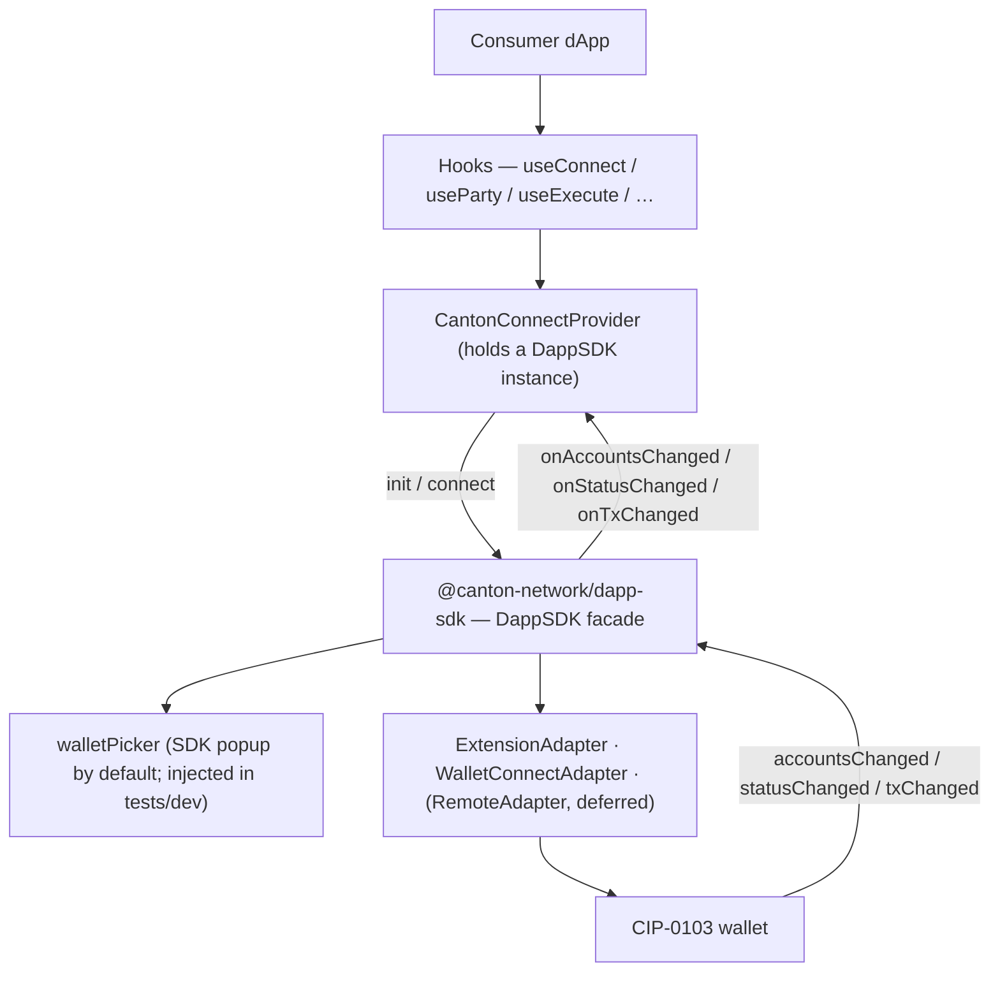

# Architecture Overview — canton-connect

`canton-connect` is a thin React wrapper over `@canton-network/dapp-sdk`'s `DappSDK` facade. It
gives consumer dApps a stable wagmi-style hook surface; the SDK owns discovery, the wallet picker,
the connection session, and every wallet transport (browser extension, WalletConnect, remote
gateway). The package is a stopgap meant to be cheap to delete as the SDK's own React story matures.

It is browser-only.

## Project Structure

```
src/
  CantonConnectProvider.tsx   React context; holds one DappSDK instance; init / connect / event wiring
  connectionMachine.ts        connection lifecycle statechart (xstate v5); internal, not yet wired (#84/#85)
  guardedConnect.ts           guardedConnect: sdk.connect() with a closed-popup watchdog (#49)
  hooks/
    useConnect.ts          connect / disconnect lifecycle
    useParty.ts            active party
    useWalletStatus.ts     lock / connect status
    useSignMessage.ts      sdk.signMessage lifecycle
    useExecute.ts          sdk.prepareExecuteAndWait + live tx state
    useLedger.ts           sdk.ledgerApi pass-through
  walletAccount.ts         account normalization + primary selection (selectPrimaryAccount, toParty)
  testing/
    fakeWallet.ts          test-only CIP-0103 extension over postMessage (also drives real discovery)
    autoPicker.ts          createAutoPicker: headless WalletPickerFn for tests/dev
    index.ts               ./testing sub-path barrel
  mock/                     createMockAdapter: a mock ProviderAdapter for dev/test
  types.ts                 Party, ConnectionStatus, CantonConnectConfig
  index.ts                 public exports
```

## Data flow



## Key abstractions

### `CantonConnectProvider`

Holds one `DappSDK` instance (`new DappSDK({ walletPicker? })`) and owns all shared state — party,
connection status, lock status, last-tx snapshot, connect error. Hooks are readers over this context
(or thin delegators to facade methods). Lifecycle:

- **mount**: `sdk.init({ additionalAdapters, defaultAdapters: [] })` cold-starts and restores a
  persisted session *without* opening the picker. If a session restores — even a locked one — events
  are wired immediately so a later unlock push isn't dropped.
- **connect()**: `sdk.connect()` opens the picker and connects the chosen wallet. A rejection passes
  through `toConnectError`, which turns the built-in picker's dismissal into `ConnectCancelledError`
  so consumers never match on a message owned by `core-wallet-ui-components`.
- **events**: `sdk.onAccountsChanged/onStatusChanged/onTxChanged` → React state. Same event names and
  types the SDK's `DappClient` exposes.

**Invariant — teardown before the client swaps.** `sdk`'s `onX`/`removeOnX` bind to the *current*
`this.client`, and `sdk.connect()` replaces the client with a new one. So listeners must be removed
*before* triggering a connect (`connect()` tears down first, then swaps, then re-wires); otherwise
they leak on the old client. `disconnect()` and unmount also tear down.

### The wallet picker

`CantonConnectConfig.walletPicker?: WalletPickerFn`. Omitted → the SDK's built-in popup (`pickWallet`,
from `core-wallet-ui-components`). Injected → a custom picker: `createAutoPicker` (headless, for
tests/dev) today, and a `canton-theme`-styled picker component later (deferred follow-up). This one
seam covers production UX, testability, and the future themed UI.

### The popup close guard

The SDK's picker attaches `beforeunload` to the popup's `WindowProxy`, and the `about:blank → blob:`
navigation that immediately follows destroys the listener, so a closed popup left `connect()` pending
forever and the dApp bricked until reload (#49). `guardedConnect(sdk)` wraps the whole `sdk.connect()`
call: it borrows `window.open` long enough to capture the handle the SDK opens, hands it straight
back, then races the connect against a poll of `popup.closed` that rejects with the SDK's own
`'User closed the wallet picker'` — which `toConnectError` already maps.

Wrapping the *call* rather than the picker is deliberate. It needs nothing from
`core-wallet-ui-components` (see [`CLAUDE.md`](CLAUDE.md) on why importing it is a trap), and the
watchdog lives for the whole connect, so it also covers the retry prompt and the wallet's own window,
not just the initial choice. It is armed only when no `config.walletPicker` is set.

**How it fails.** It fails silently, in both directions. If the SDK stops reaching for `window.open`
— an iframe, a `<dialog>`, any new picker surface — nothing is captured, `guardedConnect` degrades to
a bare `sdk.connect()`, and #49 is back with no error and no red test, because jsdom has no popup to
close. And for as long as the borrow is installed, the *first* window anything on the page opens is
the one watched, so a connect racing an unrelated `window.open` watches the wrong handle. Both are
browser-only failures. The guarantee is a manual pass, not the suite: see [`CLAUDE.md`](CLAUDE.md).

### Additional adapters

`buildAdditionalAdapters(config, networkId)` assembles the non-extension adapters passed to `sdk.init`:
`WalletConnectAdapter.create({ projectId, … })` when `walletConnectProjectId` is set, plus any
`config.additionalAdapters` (e.g. the dev/test mock adapter). Extension wallets are auto-discovered
by the facade's announce protocol — nothing to register for them. `defaultAdapters: []` suppresses
the SDK's bundled `localhost:3030` dev Wallet Gateway.

`networkId` (`CantonConnectConfig.networkId`, default `'canton:local'`) drives two things from one
field: the WalletConnect adapter's CAIP-2 `chainId` above, and `Party.networkId` (set in
`wireEvents`, via `toParty`).

### Hooks

| Hook | Responsibility |
| ------ | ---------------- |
| `useConnect` | start/stop the connection; expose error/connecting state |
| `useParty` | current primary party + connection status |
| `useWalletStatus` | lock/connect status from wallet events |
| `useSignMessage` | `sdk.signMessage` as a promise lifecycle |
| `useExecute` | `sdk.prepareExecuteAndWait` + live tx status |
| `useLedger` | raw `sdk.ledgerApi` pass-through |

## Boundaries & conventions

- Wraps `@canton-network/dapp-sdk` and nothing app-specific. No imports from `dapp/` or `canton-barebones/`. Names no wallet.
- **Import the SDK's types; never hand-copy them.** Hook params are the SDK's own (`PrepareExecuteParams`, `LedgerApiParams`); event constants come from `core-types` (`WalletEvent`, `CANTON_*_PROVIDER_EVENT`). No `as Parameters<…>` casts.
- No SDK-import quarantine — the package is a thin SDK wrapper throughout (the old `core`/`connectors` split it served was cancelled by adopting the facade).

## Deferred

- **Remote / Wallet-Gateway (OIDC) path** — a configurable `RemoteAdapter` via `additionalAdapters` + `CantonConnectConfig` (issue #2, reframed; decoupled from #3).
- **Themed wallet picker** — a `canton-theme`-styled component injected via `walletPicker`, replacing the SDK popup for UX control. Not yet filed.
- **`dapp/frontend` adoption** — the app re-adopts this package; the connection bar returns (issue #40).

For the full local stack around this package, see the root [`architecture.md`](../architecture.md).
