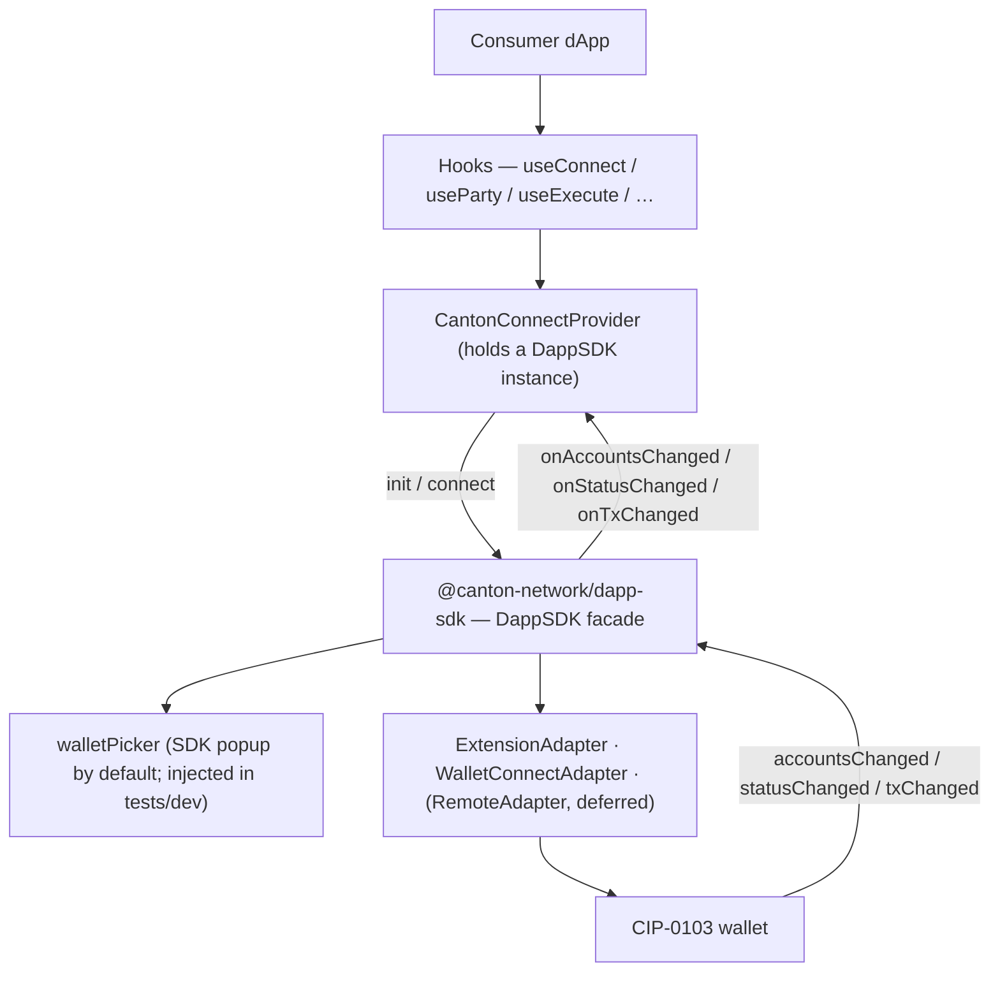

# Architecture Overview — canton-connect

`canton-connect` is a thin React wrapper over `@canton-network/dapp-sdk`'s `DappSDK` facade. It
gives consumer dApps a stable wagmi-style hook surface; the SDK owns discovery, the wallet picker,
the connection session, and every wallet transport (browser extension, WalletConnect, remote
gateway). The package is a stopgap meant to be cheap to delete as the SDK's own React story matures.

It is browser-only.

## Project Structure

```
src/
  CantonConnectProvider.tsx   React context; holds one DappSDK instance; init / connect / event wiring
  hooks/
    useConnect.ts          connect / disconnect lifecycle
    useParty.ts            active party + the connected-wallet record
    useParties.ts          every usable party, primary first
    useWalletPicker.ts     the pending in-page wallet choice
    useWalletStatus.ts     lock / connect status
    useSignMessage.ts      sdk.signMessage lifecycle
    useExecute.ts          sdk.prepareExecuteAndWait + live tx state
    useLedger.ts           sdk.ledgerApi pass-through
  walletAccount.ts         account normalization + primary-first ordering (toParties, toParty)
  connectedWallet.ts       localStorage record of which wallet the session belongs to
  testing/
    fakeWallet.ts          test-only CIP-0103 extension over postMessage (also drives real discovery)
    autoPicker.ts          createAutoPicker: headless WalletPickerFn for tests/dev
    index.ts               ./testing sub-path barrel
  mock/                     createMockAdapter: a mock ProviderAdapter for dev/test
  types.ts                 Party, ConnectionStatus, CantonConnectConfig
  index.ts                 public exports
```

## Data flow



## Key abstractions

### `CantonConnectProvider`

Holds one `DappSDK` instance (`new DappSDK({ walletPicker? })`) and owns all shared state — party,
parties, the connected-wallet record, connection status, lock status, last-tx snapshot, connect
error, and the pending wallet choice. Hooks are readers over this context (or thin delegators to
facade methods). Lifecycle:

- **mount**: `sdk.init({ additionalAdapters, defaultAdapters: [] })` cold-starts and restores a
  persisted session *without* opening the picker. If a session restores — even a locked one — events
  are wired immediately so a later unlock push isn't dropped. A *different* `DappSDK` instance
  arriving with nothing to restore sheds the previous instance's state; the same instance
  re-running `init()` does not.
- **connect()**: `sdk.connect()` opens the picker and connects the chosen wallet.
- **events**: `sdk.onAccountsChanged/onStatusChanged/onTxChanged` → React state. Same event names and
  types the SDK's `DappClient` exposes.

**Invariant — teardown before the client swaps.** `sdk`'s `onX`/`removeOnX` bind to the *current*
`this.client`, and `sdk.connect()` replaces the client with a new one. So listeners must be removed
*before* triggering a connect (`connect()` tears down first, then swaps, then re-wires); otherwise
they leak on the old client. `disconnect()` and unmount also tear down.

### The wallet picker

Three ways to answer the SDK's wallet choice, in precedence order:

- **`CantonConnectConfig.walletPicker?: WalletPickerFn`** — a supplied function owns the whole
  interaction (`createAutoPicker` in tests/dev). Wins over `walletSelection`.
- **`walletSelection: 'in-page'`** — the provider registers its own picker function, which publishes
  the pending choice through context instead of resolving it: `useWalletPicker()` exposes
  `{ isOpen, wallets, select, cancel }` while `connect()` waits. The dApp's own UI — or later a
  themed component from the UI kit — consumes those entries and callbacks as props. The kit has no
  dependency on this package and must not gain one; this context bridge is the seam that keeps it so.
- **Omitted** — the SDK's built-in popup (`pickWallet`, from `core-wallet-ui-components`).

### Additional adapters

`buildAdditionalAdapters(config, networkId)` assembles the non-extension adapters passed to `sdk.init`:
`WalletConnectAdapter.create({ projectId, … })` when `walletConnectProjectId` is set, plus any
`config.additionalAdapters` (e.g. the dev/test mock adapter). Extension wallets are auto-discovered
by the facade's announce protocol — nothing to register for them. `defaultAdapters: []` suppresses
the SDK's bundled `localhost:3030` dev Wallet Gateway.

`networkId` (`CantonConnectConfig.networkId`, default `'canton:local'`) drives two things from one
field: the WalletConnect adapter's CAIP-2 `chainId` above, and `Party.networkId` (set in
`wireEvents`, via `toParties`).

### Hooks

| Hook | Responsibility |
|------|----------------|
| `useConnect` | start/stop the connection; expose error/connecting state |
| `useParty` | current primary party + connection status + the connected-wallet record |
| `useParties` | every usable party, primary first (`party` is `parties[0]`) |
| `useWalletPicker` | the pending in-page wallet choice: entries, `select`, `cancel` |
| `useWalletStatus` | lock/connect status from wallet events |
| `useSignMessage` | `sdk.signMessage` as a promise lifecycle |
| `useExecute` | `sdk.prepareExecuteAndWait` + live tx status |
| `useLedger` | raw `sdk.ledgerApi` pass-through |

## Boundaries & conventions

- Wraps `@canton-network/dapp-sdk` and nothing app-specific. No imports from `dapp/` or `canton-barebones/`. Names no wallet.
- **Import the SDK's types; never hand-copy them.** Hook params are the SDK's own (`PrepareExecuteParams`, `LedgerApiParams`); event constants come from `core-types` (`WalletEvent`, `CANTON_*_PROVIDER_EVENT`). No `as Parameters<…>` casts.
- No SDK-import quarantine — the package is a thin SDK wrapper throughout (the old `core`/`connectors` split it served was cancelled by adopting the facade).

## Deferred

- **Remote / Wallet-Gateway (OIDC) path** — a configurable `RemoteAdapter` via `additionalAdapters` + `CantonConnectConfig` (issue #2, reframed; decoupled from #3).
- **Themed wallet picker** — a `canton-theme`-styled component consuming `useWalletPicker()`'s entries and callbacks as props, replacing the SDK popup (issue #50). The in-page bridge it will sit on is already built.
- **`dapp/frontend` adoption** — the app re-adopts this package; the connection bar returns (issue #40).

For the full local stack around this package, see the root [`architecture.md`](../architecture.md).
