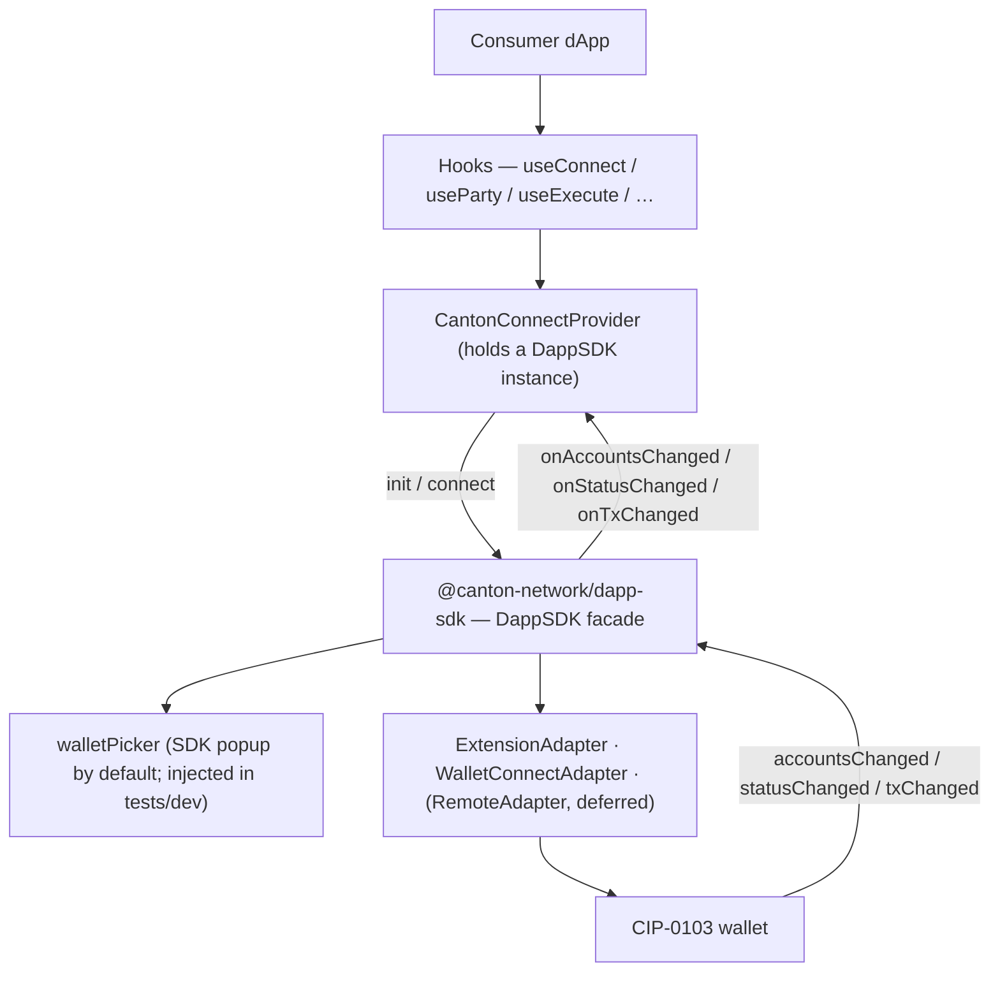

# Architecture Overview — canton-connect

`canton-connect` is a thin React wrapper over `@canton-network/dapp-sdk`'s `DappSDK` facade. It
gives consumer dApps a stable wagmi-style hook surface; the SDK owns discovery, the wallet picker,
the connection session, and every wallet transport (browser extension, WalletConnect, remote
gateway). The package is a stopgap meant to be cheap to delete as the SDK's own React story matures.

It is browser-only.

## Project Structure

```
src/
  CantonConnectProvider.tsx   React context; holds one DappSDK instance; init / connect / event wiring
  connectionMachine.ts        connection lifecycle statechart (xstate v5); internal, not yet wired (#84/#85)
  connectionActors.ts         the machine's init / connect / restore / event actors
  connectError.ts             ConnectCancelledError, PickerClosedError, toConnectError
  guardedConnect.ts           guardedConnect: sdk.connect() with a closed-popup watchdog (#49)
  hooks/
    useConnect.ts          connect / disconnect lifecycle
    useParty.ts            active party
    useWalletStatus.ts     lock / connect status
    useSignMessage.ts      sdk.signMessage lifecycle
    useExecute.ts          sdk.prepareExecuteAndWait + live tx state
    useLedger.ts           sdk.ledgerApi pass-through
  walletAccount.ts         account normalization + primary selection (selectPrimaryAccount, toParty)
  testing/
    fakeWallet.ts          test-only CIP-0103 extension over postMessage (also drives real discovery)
    autoPicker.ts          createAutoPicker: headless WalletPickerFn for tests/dev
    stubPopup.ts           popup + window.open doubles for the close guard; off the barrel
    index.ts               ./testing sub-path barrel
  mock/                     createMockAdapter: a mock ProviderAdapter for dev/test
  types.ts                 Party, ConnectionStatus, CantonConnectConfig
  index.ts                 public exports
```

## Data flow



## Key abstractions

### `CantonConnectProvider`

Holds one `DappSDK` instance (`new DappSDK({ walletPicker? })`) and owns all shared state — party,
connection status, lock status, last-tx snapshot, connect error. Hooks are readers over this context
(or thin delegators to facade methods). Lifecycle:

- **mount**: `sdk.init({ additionalAdapters, defaultAdapters: [] })` cold-starts and restores a
  persisted session *without* opening the picker. If a session restores — even a locked one — events
  are wired immediately so a later unlock push isn't dropped.
- **connect()**: `sdk.connect()` opens the picker and connects the chosen wallet. A rejection passes
  through `toConnectError`, which turns the built-in picker's dismissal into `ConnectCancelledError`
  so consumers never match on a message owned by `core-wallet-ui-components`.
- **events**: `sdk.onAccountsChanged/onStatusChanged/onTxChanged` → React state. Same event names and
  types the SDK's `DappClient` exposes.

**Invariant — teardown before the client swaps.** `sdk`'s `onX`/`removeOnX` bind to the *current*
`this.client`, and `sdk.connect()` replaces the client with a new one. So listeners must be removed
*before* triggering a connect (`connect()` tears down first, then swaps, then re-wires); otherwise
they leak on the old client. `disconnect()` and unmount also tear down.

### The wallet picker

`CantonConnectConfig.walletPicker?: WalletPickerFn`. Omitted → the SDK's built-in popup (`pickWallet`,
from `core-wallet-ui-components`). Injected → a custom picker: `createAutoPicker` (headless, for
tests/dev) today, and a `canton-theme`-styled picker component later (deferred follow-up). This one
seam covers production UX, testability, and the future themed UI.

### The popup close guard

The SDK's picker attaches `beforeunload` to the popup's `WindowProxy`, and the `about:blank → blob:`
navigation that immediately follows destroys the listener, so a closed popup left `connect()` pending
forever and the dApp bricked until reload (#49). `guardedConnect(sdk)` wraps the whole `sdk.connect()`
call: it borrows `window.open` long enough to capture the handle the SDK opens, hands it straight
back, then races the connect against a poll of `popup.closed` that rejects with `PickerClosedError`,
carrying the SDK's own `'User closed the wallet picker'` so `toConnectError` maps it unchanged. The
handle is remembered module-side, because a connect reusing a popup the last one left open (the
normal path for `reuseGlobalWalletPopup` wallets) calls `window.open` not at all.

**Why the call and not the picker.** Our own `walletPicker` would be the deeper seam, and the SDK
already offers it. What blocks that route is not the `core-wallet-ui-components` trap in
[`CLAUDE.md`](CLAUDE.md) — a picker of ours needs nothing from that package either — but that this
package holds no picker UI by rule, and the themed one is deferred and unfiled. So the borrow is a
stopgap standing in for a picker, not the end state.

**A rejected race leaves the SDK's `connect()` running.** It is still listening for a picker result,
and would swap the SDK's client from under the provider's event wiring on the *next* connect. That is
what `PickerClosedError` is for: `CantonConnectProvider` retires its `DappSDK` on one, and the mount
effect re-restores the session from the discovery session key that `connect()` never clears.

Retiring the instance does not by itself reach the orphan. The abandoned `connect()` is parked inside
`core-wallet-ui-components` module scope on a `message` listener keyed to nothing but our origin and
the message type, so the *next* successful connect woke every past one: one `discovery.connect`, and
one wallet approval prompt, per popup the user had closed.

`settleAbandonedConnect` drains them at the close instead. It posts the SDK's own
`SPLICE_WALLET_PICKER_RESULT` to our window, which is the only thing that makes that listener
unsubscribe; the `providerId` matches no registered adapter, so the orphan fails with
`WalletNotFoundError` before reaching a wallet, then rejects out of
`waitForWalletPickerRetrySelection` because the popup is closed. `walletType` stays `'browser'` to
keep it out of the branch that registers a remote adapter from the message. It is skipped while a
second guard is in flight, since the message would resolve that one's live waiter too — a heuristic,
because only guarded connects are counted.

This is a workaround, not containment: the orphan still runs. The real fix is an abort on
`DappSDK.connect()`, upstream.

**The watchdog stands down once a wallet is chosen.** Past the pick the connect is waiting on the
wallet, not the popup, so closing the popup is no longer a dismissal — treating it as one abandoned a
live connect and left an unanswered approval request behind, one per close. Only for
`walletType: 'browser'`: for remote and mobile the popup *is* the wallet surface, so a close there
still strands the connect and must keep rejecting. The consequence is that closing the popup after
choosing an extension leaves the button pending until the wallet is answered, with no way to cancel —
the same shape as MetaMask's `eth_requestAccounts`. Nothing can retract a CIP-0103 `connect` already
sent, and a wallet that stacks rather than replaces duplicate requests will show one prompt per
attempt regardless.

**How it fails.** For as long as the borrow is installed, the first window anything on the page opens
is the one watched, so a connect racing an unrelated `window.open` watches the wrong handle. An SDK
that stops reaching for `window.open` at all degrades the guard to a bare `sdk.connect()` — that much
is pinned headless, since both provider tests wait on a URL only the SDK's own popup code writes.

The drain and the stand-down have no such backstop. Both rest on the `SPLICE_WALLET_PICKER_RESULT`
message — its type, its origin, and the `walletType` and `providerId` fields — none of it public API.
A rename turns the drain into a no-op that returns the duplicate prompts, and turns the stand-down
into the old behaviour of abandoning a live connect, with nothing going red either way. Nor does any
test reach #49's own *cause*, a real `WindowProxy` losing its `beforeunload` across the navigation.
All of it is why a `dapp-sdk` bump needs the manual pass in [`CLAUDE.md`](CLAUDE.md).

### Additional adapters

`buildAdditionalAdapters(config, networkId)` assembles the non-extension adapters passed to `sdk.init`:
`WalletConnectAdapter.create({ projectId, … })` when `walletConnectProjectId` is set, plus any
`config.additionalAdapters` (e.g. the dev/test mock adapter). Extension wallets are auto-discovered
by the facade's announce protocol — nothing to register for them. `defaultAdapters: []` suppresses
the SDK's bundled `localhost:3030` dev Wallet Gateway.

`networkId` (`CantonConnectConfig.networkId`, default `'canton:local'`) drives two things from one
field: the WalletConnect adapter's CAIP-2 `chainId` above, and `Party.networkId` (set in
`wireEvents`, via `toParty`).

### Hooks

| Hook | Responsibility |
| ------ | ---------------- |
| `useConnect` | start/stop the connection; expose error/connecting state |
| `useParty` | current primary party + connection status |
| `useWalletStatus` | lock/connect status from wallet events |
| `useSignMessage` | `sdk.signMessage` as a promise lifecycle |
| `useExecute` | `sdk.prepareExecuteAndWait` + live tx status |
| `useLedger` | raw `sdk.ledgerApi` pass-through |

## Boundaries & conventions

- Wraps `@canton-network/dapp-sdk` and nothing app-specific. No imports from `dapp/` or `canton-barebones/`. Names no wallet.
- **Import the SDK's types; never hand-copy them.** Hook params are the SDK's own (`PrepareExecuteParams`, `LedgerApiParams`); event constants come from `core-types` (`WalletEvent`, `CANTON_*_PROVIDER_EVENT`). No `as Parameters<…>` casts.
- No SDK-import quarantine — the package is a thin SDK wrapper throughout (the old `core`/`connectors` split it served was cancelled by adopting the facade).

## Deferred

- **Remote / Wallet-Gateway (OIDC) path** — a configurable `RemoteAdapter` via `additionalAdapters` + `CantonConnectConfig` (issue #2, reframed; decoupled from #3).
- **Themed wallet picker** — a `canton-theme`-styled component injected via `walletPicker`, replacing the SDK popup for UX control. Not yet filed.
- **`dapp/frontend` adoption** — the app re-adopts this package; the connection bar returns (issue #40).

For the full local stack around this package, see the root [`architecture.md`](../architecture.md).
