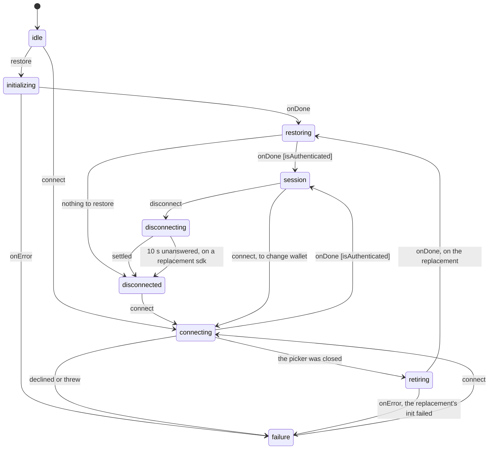
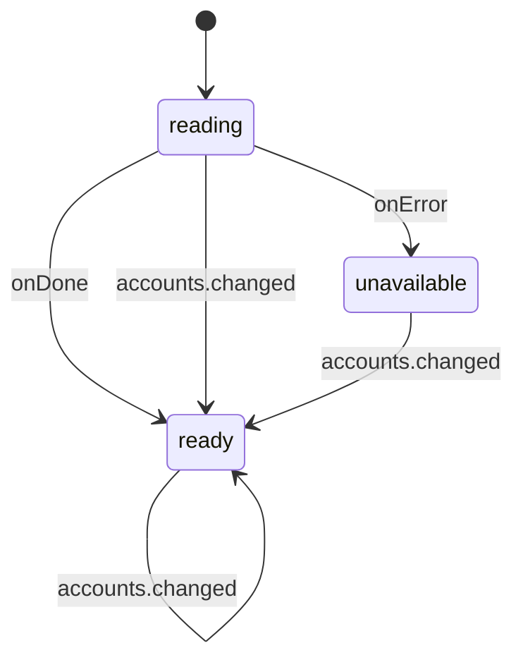

# The connection machine

Reference for `machine/connectionMachine.ts`: the states, what each one means to a caller, and what
settles `connect()` and `disconnect()`. The code is the authority; when the two disagree, fix this
file.

## The spine

`session` holds `unauthenticated` (the wallet reports it will not serve requests) and
`authenticated`, whose three substates mirror the accounts child: `reading`, `ready`, `unavailable`.
Entry always targets `authenticated`; only a wallet push reaches `unauthenticated`.
`disconnecting` is a single state: a connect asked for while it runs is ignored, not queued, so it
never leads anywhere but `disconnected`. Ten seconds without the wallet's answer takes that same
exit, on a replacement sdk: the SDK's request carries no deadline of its own.

Three events reach further than the diagram shows. `connect` is taken everywhere except `connecting`
and `disconnecting`. `disconnect` is taken everywhere except `idle`, `disconnected` and
`disconnecting`. `restore` is taken by `idle`, `disconnected`, `session` and `failure`. A fourth,
`connectError.reset`, is taken everywhere and changes no state.

The wallet's push arrives as `wallet.statusChanged`, sent by the `walletEvents` actor:
`session.authenticated` leaves for `unauthenticated` when `connection.isConnected` is false, and
`unauthenticated` returns to `authenticated` when it is true.

## States

| state | means | public `status` |
|---|---|---|
| `idle` | nothing attempted yet | `idle` |
| `initializing` | SDK cold start | `idle` |
| `restoring` | asking the wallet for a session | `idle` |
| `connecting` | the wallet is deciding | `connecting` |
| `session.unauthenticated` | session alive, wallet not authenticated, party dropped | `connected` |
| `session.authenticated.reading` | account read in flight | `connected` |
| `session.authenticated.ready` | party known | `connected` |
| `session.authenticated.unavailable` | the read failed, session intact | `connected` |
| `failure` | the attempt failed; the error stays in context until exit | `disconnected` |
| `retiring` | the closed picker's instance is abandoned, its replacement booting | `disconnected` |
| `disconnecting` | the wallet is being asked to end the session; unanswered for 10 s, it settles anyway on a replacement sdk | `disconnecting` |
| `disconnected` | asked, and there is nothing | `disconnected` |

## What each actor reaches for

| actor | invoked by | reaches |
|---|---|---|
| `init` | `initializing`, `retiring` | `sdk.init`, once per SDK instance; the SDK caches a rejection forever, so only a replacement retries |
| `connect` | `connecting` | `init`, then `guardedConnect` or `sdk.connect`, then `sdk.status` when the answer is not connected |
| `restore` | `restoring` | `sdk.status`; an answer without `connection` counts as nothing to restore |
| `disconnect` | `disconnecting` | `sdk.disconnect`, under the machine's 10 s deadline since the SDK sets none |
| `walletEvents` | `session` | `sdk.onStatusChanged` |
| `accounts` | `session.authenticated` | `accountsMachine` |
| `readAccounts` | `accounts.reading` | `sdk.listAccounts`, then `selectUsableAccounts`, `selectPrimaryAccount`, `toParty` |
| `accountsEvents` | the accounts root | `sdk.onAccountsChanged` |

Each reads its sdk off the invoke's input, resolved from context when the invoke starts, so leaving
the state stops the actor and drops the listener with it.

## What settles a promise

The `connect()` and `disconnect()` columns describe the bridges the provider PR adds; on this branch
the tags exist and nothing awaits them.

| machine state | tags | `connect()` | `disconnect()` |
|---|---|---|---|
| `idle` | `disconnect.settled` | waits | resolves |
| `initializing`, `restoring` | none | waits | waits |
| `connecting` | `connecting` | waits | already answered, one state earlier |
| `session.authenticated.reading` | `connecting` | waits | waits |
| `session.authenticated.ready` | `connect.settled` | resolves | waits |
| `session.authenticated.unavailable` | `connect.failed` | rejects, wallet's error | waits |
| `session.unauthenticated` | `connect.settled`, `unauthenticated` | resolves, no party | waits |
| `failure` | `connect.failed` | rejects, recorded error | waits |
| `retiring` | `connect.cancelled` | rejects, `ConnectCancelledError` | waits |
| `disconnecting` | none | waits | waits |
| `disconnected` | `connect.cancelled`, `disconnect.settled` | rejects, `ConnectCancelledError` | resolves |

The last two tags are for hooks rather than bridges: `connecting` answers `isConnecting`,
`unauthenticated` answers `isLocked`. On this branch nothing reads them; the provider PR wires both.
A five-way enum stays a selector's job, so `status` is `toConnectionStatus`.

Four placements carry weight:

- **`session.unauthenticated` settles a connect.** A wallet that connects locked answers no account
  read, so waiting for a party would wait forever.
- **Entering it drops the party.** A wallet that will not serve requests has no party to offer, and
  a lock and a wallet-side disconnect arrive as the same push, so the two cannot be told apart. The
  session itself stays, which is what keeps the listener alive: an unlock pushes `isConnected: true`
  and the party is read again with no reconnect.
- **A connect during `disconnecting` is ignored, not queued.** `sdk.connect()` and `sdk.disconnect()`
  both rewrite the client and must not overlap, so `disconnecting` handles no `connect` and always
  ends at `disconnected`. Its public `status` is `disconnecting`, so a consumer keeps its connect
  action disabled until the disconnect settles.
- **`retiring` cancels rather than fails.** The user closed the picker, so nothing failed, even
  though the machine goes on to boot a replacement and restore on it.

## The last connect error

`lastConnectError` rides in context and outlives the state that produced it, so a recovered session
can still say why the attempt before it failed. It is cleared on entering `connecting`, `retiring`
and `disconnecting`, by `connectError.reset` (the event the provider PR puts behind
`useConnect().reset()`), and by a push that recovers a failed read.

The two ways a picker close reaches the caller differ. A close the watchdog catches records nothing:
`connecting` goes to `retiring`, which clears the error, and `connect()` rejects with a fresh
`ConnectCancelledError`. A dismissal the SDK itself rejects (`'User closed the wallet picker'`) goes
to `failure` and is recorded; the provider classifies it with `toConnectError` as
`ConnectCancelledError` on the way to `connectError`. Either way a consumer filters by `instanceof`,
never by message.

## The accounts machine

A push wins from any state, an in-flight read included. `ready` may still carry no `party`, which is
a wallet reporting no usable account. The parent mirrors the three states into
`session.authenticated` through the invoke's `onSnapshot`.
