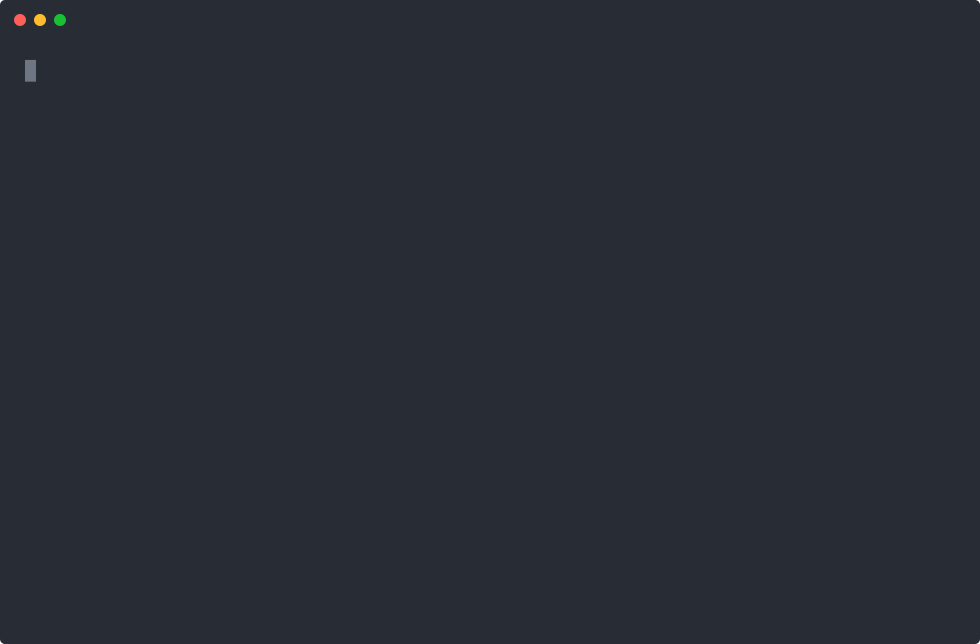

# Canton dAppBooster installer

## Requirements

- Node >= 22.12.0 to run the installer, and >= 24.15.0 for the project it makes, which the Canton
  dApp kit libraries require
- npm, pnpm, yarn or bun. The installer installs the packages with the one that runs it.

The local network also needs Docker and pnpm, and building a contract needs `dpm`. Check the
[documentation](https://docs.dappbooster.cc/) for more info.

## Interactive mode



```shell
pnpm create canton-dappbooster
```

The wizard asks for the project name, the local network and the dApp. It then copies the dApp,
creates `.env` from `.env.example`, installs the packages, makes a git repository with a first
commit, and prints the next steps. If a step fails, it removes what it wrote.

Alternatively, you can start with a preselected dApp or local network:

- **Amulet Vesting:** a vesting dApp frontend and its contracts.
- **Barebones:** a minimal local Canton stack for developer workflows.

```shell
pnpm create canton-dappbooster --example amulet-vesting   # Amulet Vesting dApp
pnpm create canton-dappbooster --localnet                 # Barebones local network
```

With npm, put `--` before the flags: `npm create canton-dappbooster -- --localnet`. With pnpm,
leave it out, because pnpm passes the `--` on and the installer reads every flag after it as a
folder name.

## Non-interactive mode (agents and CI)

Run without an interactive terminal, the installer asks nothing. The installer then needs the folder,
and the choices the flags leave out take their defaults: the starter dApp and no local network.

| Flag | Purpose |
|---|---|
| `[directory]` | Folder to create the project in, new or empty. Required without a terminal |
| `--example <name>` | Start from an example dApp instead of the starter. Takes a name from the table below, or any spec `npm pack` accepts |
| `--localnet` | Add the Barebones local network |
| `--skip-install` | Write the files and stop before installing the packages |
| `--disable-git` | Skip the git repository. The installer also skips it when the folder is already inside one |
| `-h`, `--help` | Show the usage text |

```shell
pnpm create canton-dappbooster my-dapp                                       # starter dApp
pnpm create canton-dappbooster my-dapp --example amulet-vesting --localnet   # Amulet Vesting with Barebones
```

### dApps

| dApp | Flag | Default | Description |
|---|---|---|---|
| `Starter dApp` | none | ✓ | Barebones dApp that connects to a wallet and gives you a sample contract |
| `Amulet Vesting` | `--example amulet-vesting` | | A vesting dApp frontend and its contracts |

### Local networks

| Local network | Flag | Default | Description |
|---|---|---|---|
| `No localnet` | none | ✓ | You provide your own |
| `Barebones` | `--localnet` | | Minimal local Canton stack for developer workflows |

## Installer development

```shell
git clone git@github.com:BootNodeDev/canton-dappbooster.git
cd canton-dappbooster
nvm use
corepack enable
pnpm i
pnpm -C canton-create try
```

`try` packs the installer and every example dApp into `canton-create/.try` and prints the commands
that run them there, as a user would. `pnpm -C canton-create try:clean` stops whatever those
projects started and removes `.try`.
